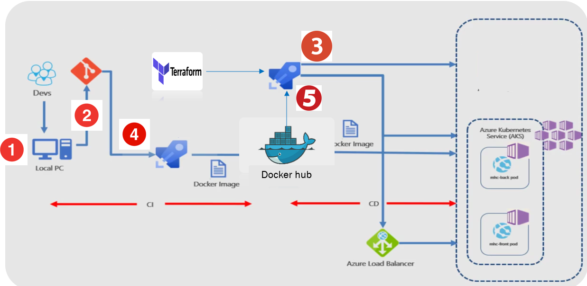

# project-devops
Project development stages:

•	Create service principal (an identity created for use with applications, hosted services, and automated tools to access Azure resources.):

$ az ad create-for-rbac –role=”Contributor” –scopes=”/subscription/ID(of the subscription)”
Create public ssh key.

•	Write terraform script in order to:
-Create azure resource group.
-Create AKS cluster (azurerm Kubernetes cluster) (by specifying service principal, node pool name, node count and size)
-Create storage container for storing terraform state. (backend)

•	In Azure devops platform: 
make service connection to Azure.

•	2 pipelines:
-	First pipeline (IAAC) for provisioning the cluster infrastructure.
Download public key /Terraform init/terraform apply 
You can install the Azure CLI .and then connect to azure Kubernetes cluster using Azure CLI
$ az aks get-credentials –name (name of the k8s cluster) –resource_group (name of the resource group) 
               In azure devops project: add a Kubernetes service connection

-	Second pipeline (CI/CD) for deploying the application container into the cluster. 
Reminder: A stage contains one or more jobs. Each job runs on an agent. A job represents an execution boundary of a set of steps. All of the steps run together on the same agent.
Stage 1:
Build docker image
Publish the k8s Files
Stage 2:
Download the k8s Files to system artifact directory
Deploy to k8s cluster with docker image we created earlier
```

```
Technologies used in this project:
-	Cloud provider: Azure
-	CI/CD tool : Azure devops 
-	Infrastructure as a code: Terraform
-	System for managing containerized applications: AKS azure Kubernetes service
